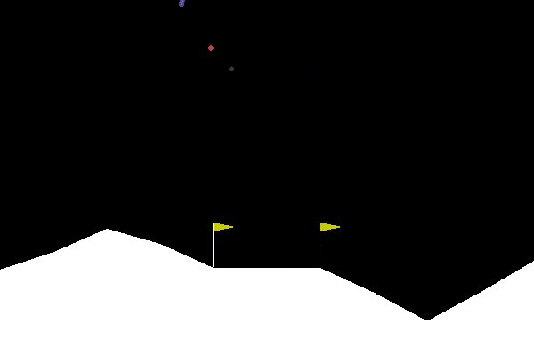
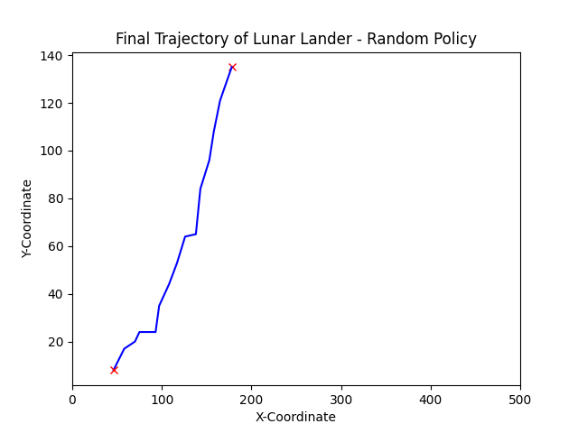
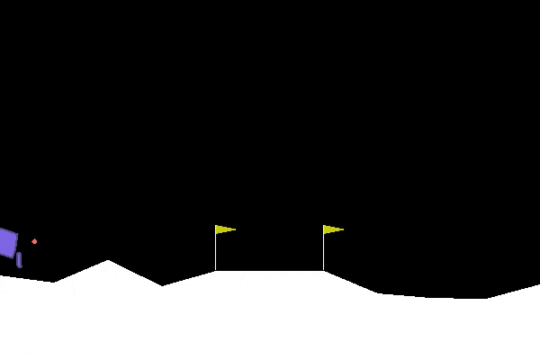
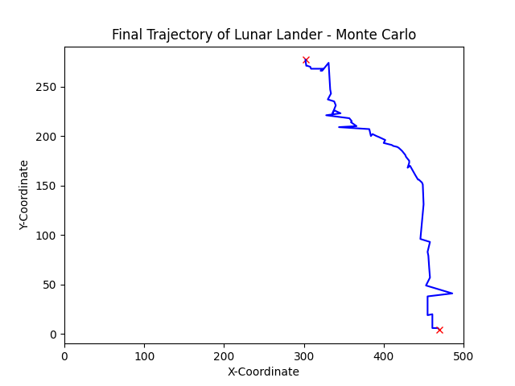
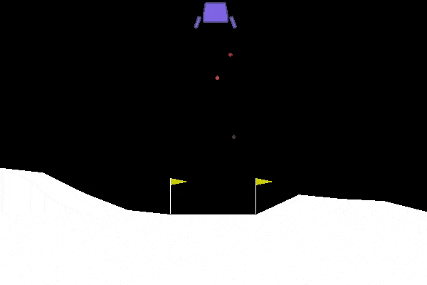
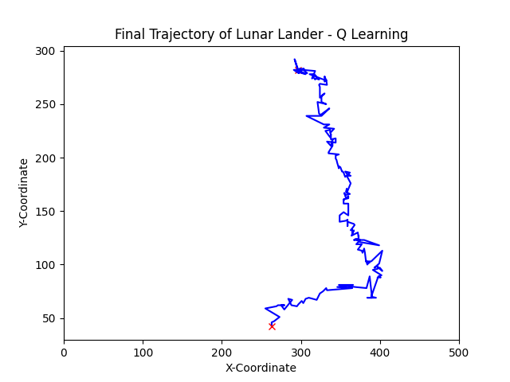
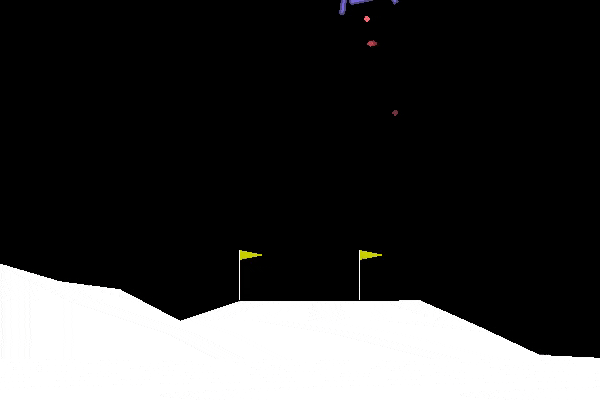
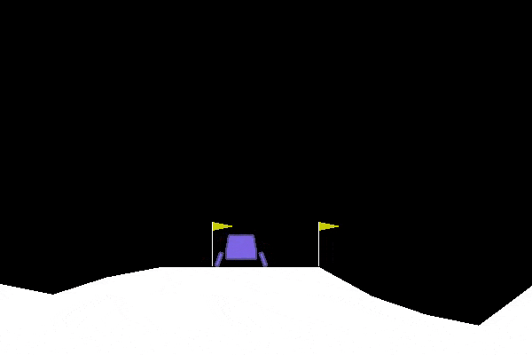
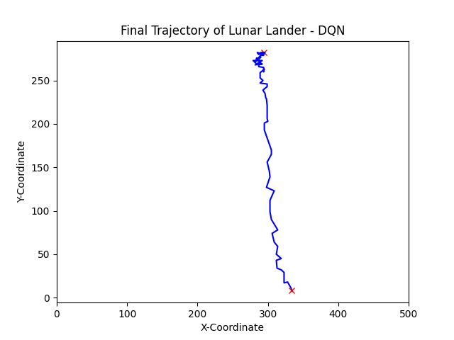

# AE504 Final Project 
## Authors: [Gokul Puthumanaillam](https://github.com/gokulp01), [Manav Vora](https://github.com/Manavvora)

This is a code for comparing different algorithms to solve the lunar lander problem. The algorithms simulated are:
1. Monte Carlo
2. Q-Learning
3. DQN
4. SARSA

# Outputs:

Simulation            |  Final Trajectory
:-------------------------:|:-------------------------:
*Random policy* |  
*Monte Carlo* | 
*QLearning* | 
*SARSA* | 
*DQN* | 

